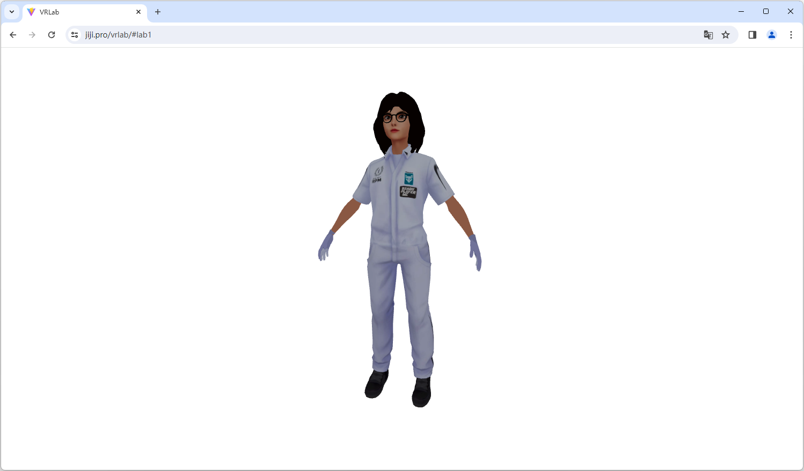
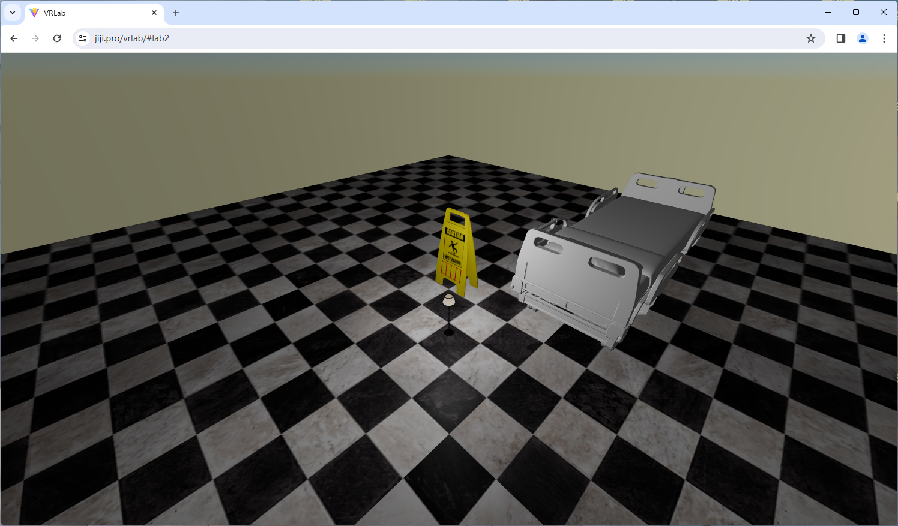
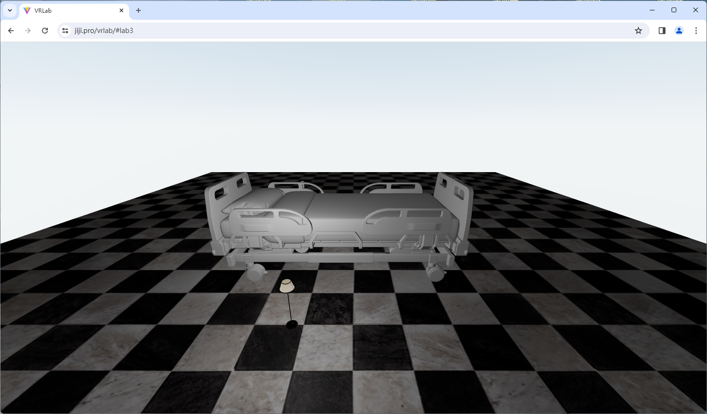

# VRLab

## 介绍

### 开发环境

- Node.js with React
- VSCode (as IDE)

### 使用到的库

- [react-three-fiber](https://docs.pmnd.rs/react-three-fiber)

## 复现方法

```bash
git clone https://github.com/mmdjiji/vrlab
cd vrlab
npm install
npm run dev
```

## Lab1

[在线演示](https://jiji.pro/vrlab/#lab1)

### 实验内容

建立一个编程环境，实现读入三维物体，进行线框显示，shading, 纹理映射以及旋转，zoom in/out等功能。

读入的三维模型： 点云，mesh、volume model, NURBS

### 效果截图



### 方法

首先先建立一个 3D 模型，我选择在 https://readyplayer.me 中建立一个人物的 3D 模型用于学习如何使用 Three.js 渲染。

在建立完成后，会得到一个glb文件，这个文件相当于三角片（mesh）的 3D 模型，同时包含贴图等其他信息。

使用库提供的代码加载模型:
```js
const model = useLoader(
  GLTFLoader,
  "/vrlab/avatar.glb"
);
```

加载到内存中，需要绘制模型，核心代码为:
```js
<mesh ref={mySelfRef}>
  <hemisphereLight intensity={0.15} />
  <ambientLight />
  <primitive
    object={model.scene}
    scale={1}
  />
</mesh>
```

为了让模型可以平移旋转，我们一个比较聪明的方法是再添加一个摄像机，只旋转摄像机。基于 Canvas 可以很容易地实现这一切:
```js
<Canvas
  style={{ backgroundColor: "white" }}
  camera={{ position: [1, 1, 4] }}
>
  <Orbit />
</Canvas>
```

## Lab2

[在线演示](https://jiji.pro/vrlab/#lab2)

### 实验内容

设计一个三维场景，实现尽可能真实绘制

### 效果截图



### 方法

首先创建天空，Three.js 中包含天空的标准实现：
```js
import { Sky } from '@react-three/drei';
<Sky scale={1000} sunPosition={[500, -20, -1000]} turbidity={0.1} />
```

我在 https://sketchfab.com 上下载了一些资源模型，例如地板、落地灯、指示牌和病床，把它们加载进来：

```js
const floor = useLoader(GLTFLoader, "/vrlab/floor.glb");
const tip = useLoader(GLTFLoader, "/vrlab/tip.glb");
const lamp = useLoader(GLTFLoader, "/vrlab/lamp.glb");
const bed = useLoader(GLTFLoader, "/vrlab/bed.glb");
```

使用 `<mesh>` 标签把它们呈现在画面中，并调整一个合适的布局。由于我并不是学习美术的所以放置的位置可能并不具有很强的艺术性，但合理可用于学习即可。

之后给落地灯添加一个点光源，我这里设置的是每次打开页面的时候亮度自动随机生成，这样就可以看到不同亮度的效果了。

```js
<pointLight
  position={[2, 4, 2]}
  decay={Math.random() * 2}
  intensity={Math.PI}
/>
```

## Lab3

[在线演示](https://jiji.pro/vrlab/#lab3)

### 实验内容

设计一个三位动画短片，内容自选。

### 效果截图



### 方法

为了让 mesh 运动，可以采用帧动画的方式：

```js
useFrame(({ clock }) => {
  const a = clock.getElapsedTime();
  console.log(a);
});
```

我们直接重写 useFrame 回调函数，在每次渲染过程发生时，这个函数就会被自动执行。

clock 是系统时钟，通过它可以获取一个相对时间，以便于我们实现动画。

下面我们尝试让 [Lab2](#lab2) 中的日出日落动起来，首先需要把 `<Sky>` 抽象出来：

```js
const MySun = () => {
  const mesh = useRef();
  return (
    <Sky ref={mesh} scale={1000} turbidity={0.1} />
  );
}
```

然后针对它的属性编写代码修改：
```js
useFrame(({ clock }) => {
  const a = clock.getElapsedTime() / 2;
  const x = Math.sin(a) * 1000;
  const y = Math.cos(a) * 1000;
  const z = Math.sin(a) * 1000;
  mesh.current.material.uniforms.sunPosition.value = [x, y, z]
});
```

为了让它实现往复运动，使用三角函数的方式可以最大化简化动画逻辑，且优雅。这样就能实现太阳的东升西落了。

然后我们再来实现画面中床的运动，我们尽量采用往复运动的方式，也是使用三角函数：

```js
const Bed = () => {
  const mesh = useRef();
  const bed = useLoader(GLTFLoader, "/vrlab/bed.glb");
  useFrame(({ clock }) => {
    const a = clock.getElapsedTime() / 2;
    mesh.current.position.z = Math.sin(a) * 2;
  })
  return (
    <primitive
      ref={mesh}
      object={bed.scene}
      scale={0.03}
      position={[4, 2.1, -5]}
    />
  );
}
```
